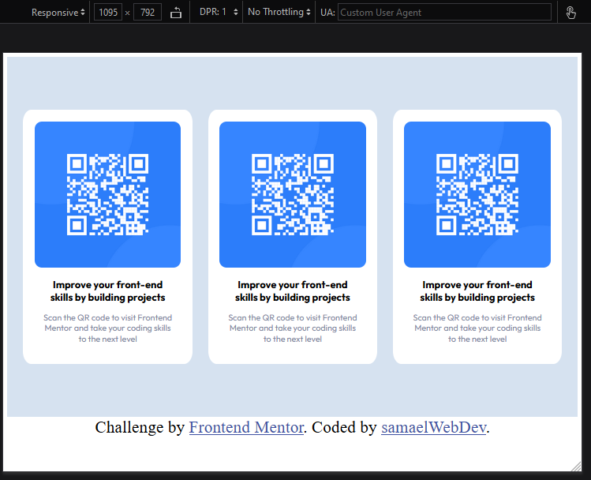
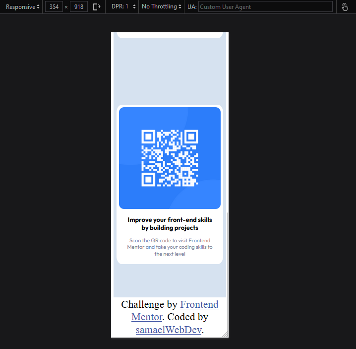

# Frontend Mentor - QR code component solution

This is a solution to the [QR code component challenge on Frontend Mentor](https://www.frontendmentor.io/challenges/qr-code-component-iux_sIO_H). Frontend Mentor challenges help you improve your coding skills by building realistic projects.

## Table of contents

- [Screenshot](#screenshot)
- [Links](#links)
- [My process](#my-process)
  - [Built with](#built-with)
  - [What I learned](#what-i-learned)
  - [Continued development](#continued-development)
  - [Useful resources](#useful-resources)
- [Author](#author)
- [Acknowledgments](#acknowledgments)

### Screenshot

### Links

- Solution URL: [Add solution URL here](https://your-solution-url.com)
- Live Site URL: [https://samaelwebdev.github.io/FrontEndMentor-qr-code-component/)

## My process

### Built with

- Semantic HTML5 markup
- CSS custom properties
- Flexbox

### What I learned

As a beginner, while creating this simple desing I learned the importance on units ( px, rem, rem, etc) and how they behave differently in different scenarios.

### Continued development

My goal is to build higher complexity projects implementing different layout techiniques and discover design ideas.

## Author

- Frontend Mentor - [samaelwebdeve](https://www.frontendmentor.io/profile/samaelwebdev)
